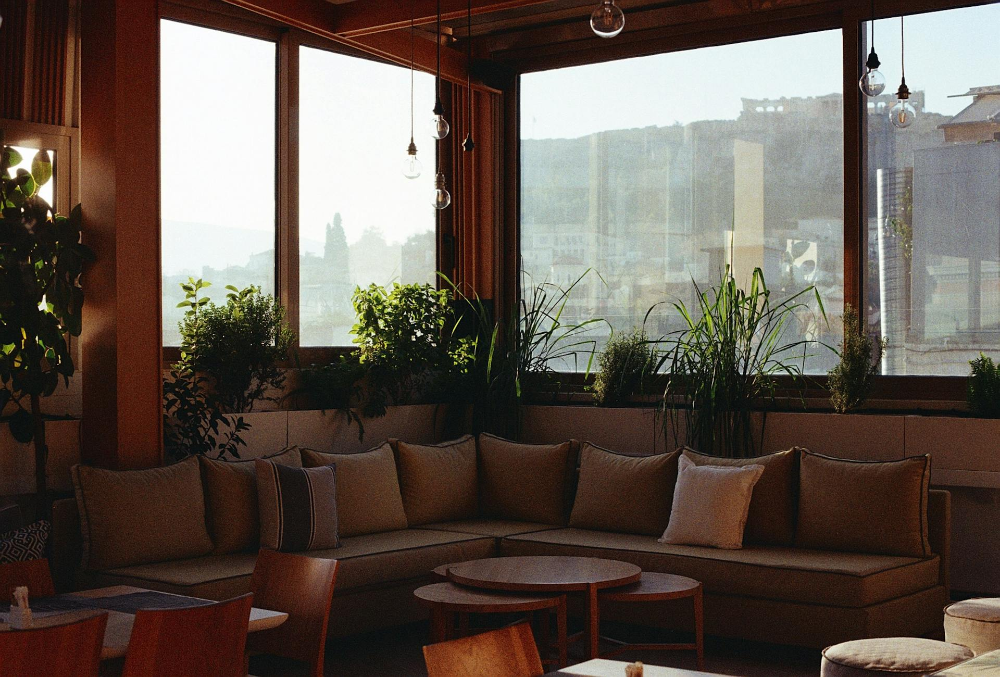

# 🏠 Opulentia — Residências de Luxo


> Landing page para a marca **Opulentia Residências de Luxo**, com foco em design elegante, imersivo e responsivo.

---

## 📸 Preview



---

## 📁 Estrutura do Projeto

```
opulentia/
├── index.html        # Estrutura principal da página
├── style.css         # Estilização completa
├── Opulentia.png     # Logo da marca
└── apartamento.jpg   # Imagem de fundo do banner
```

---

## ✨ Funcionalidades

- **Navbar responsiva** com logo e links de navegação
- **Efeito hover** nos itens do menu com linha animada em vermelho
- **Banner fullscreen** com imagem de fundo e overlay escuro
- **Botão animado** com preenchimento deslizante ao passar o mouse
- **Tipografia elegante** com texto centralizado e hierarquia visual clara

---

## 🎨 Design

| Elemento | Detalhe |
|----------|---------|
| Cor de destaque | `#e84624` (vermelho) |
| Fundo | Imagem com overlay `rgba(0,0,0,0.75)` |
| Fonte | `sans-serif` |
| Layout | Flexbox + posicionamento absoluto |

---

## 🚀 Como usar

1. Clone o repositório:
```bash
git clone https://github.com/seu-usuario/opulentia.git
```

2. Abra o arquivo `index.html` no navegador — nenhuma dependência necessária.

---

## 📌 Tecnologias

- HTML5 semântico
- CSS3 com transições e animações
- Layout responsivo com Flexbox

---

## 📄 Licença

Este projeto está sob a licença MIT. Veja o arquivo `LICENSE` para mais detalhes.

---

<p align="center">Feito com ❤️ para <strong>Opulentia Residências de Luxo</strong></p>
